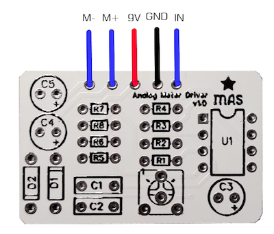

# VU Meter driver board

Most VU meters these days are actually DC meters, so they need a rectifier. And if you're going to use them you typically want a buffer to prevent noise, too.  This PCB provides both, along with adjustable gain, and is a dead quiet, simple drop-in for any pedal and should work with any DC meter.

It provides a decorative dancing needle to your audio projects, but understand this isn't an ideal way to take measurements if accuracy is your goal.

You can get the meters dirt cheap, and scavenge them from battery testers, CB testers, and other old junk.  You can also find plenty for sale new by searching "*DC needle meter*" or similar search terms.

[Buy VU meter PCB here](https://mas-effects.square.site/product/vu-meter-driver/53?cp=true&sa=true&sbp=false&q=false) or use the files in this repository to create your own.

## Instructions

See the build documents at <https://mas-effects.com/vu.pdf>
