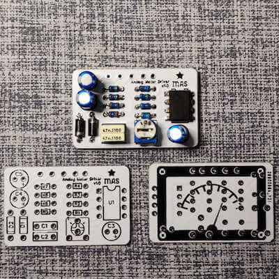
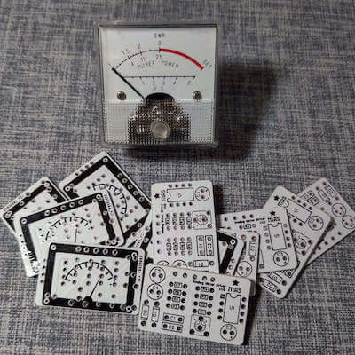

# VU Meter driver board

Most VU meters these days are actually DC meters, so they need a rectifier. And if you're going to use them you typically want a buffer to prevent noise, too.

The good news is you can get the meters dirt cheap, and scavenge them from battery testers, CB testers, and other old junk.  You can also find plenty for sale new by searching "*DC needle meter*" or similar search terms.

This PCB is a dead quiet, simple drop-in for any pedal, and should work with any DC meter.

[Buy VU meter PCB here](https://mas-effects.square.site/product/vu-meter-driver/53?cp=true&sa=true&sbp=false&q=false) or use the files in this repository to create your own.

## Building and Adjusting

Assembly should be straightforward, but contact me if you'd like a detailed build doc.

The level can be adjusted using RV. Although the PCB has holes for a trimmer, you can absolutely use an off-board potentiometer, fixed resistor, or even multiple resistors selectable with a toggle switch.

Perhaps not surprisingly, you will find this responds differently to humbuckers and single coil pickups.  Having an off-board potentiometer or toggle switch can make it a lot more convenient to use than a trimmer.

## Modifications

#### Needle speed

You can adjust the value of C4 to alter how quickly the needle rises falls back down.
100uF, for example, will slow it down considerably.

#### Reducing bass responsiveness

By default the low notes will push the needle harder than higher notes. If you want to counteract this you can try decreasing the value of either C2 or C3.

For example, changing C3 to 100nF will tame the needle when strumming heavily on the lower strings.
